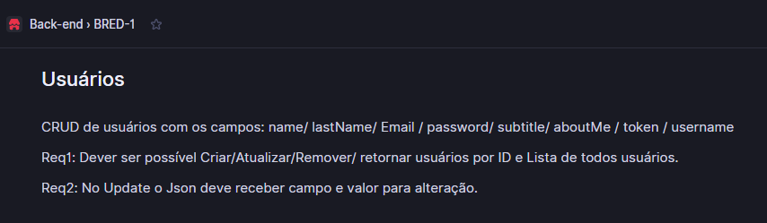
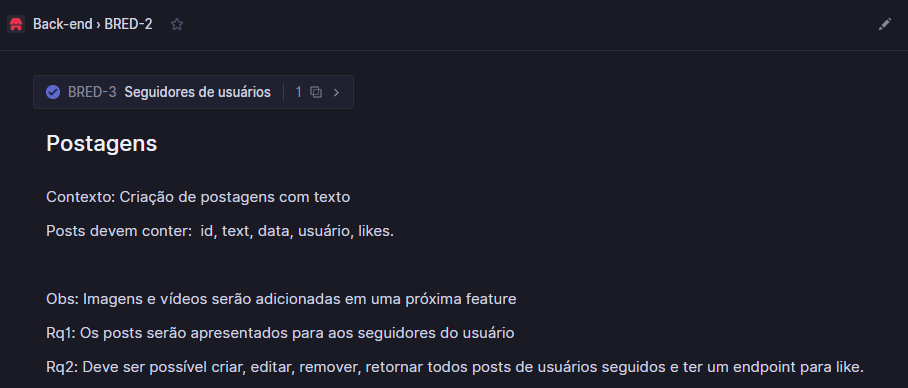
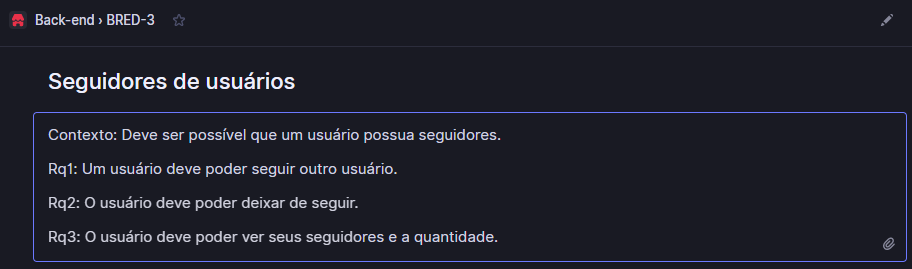
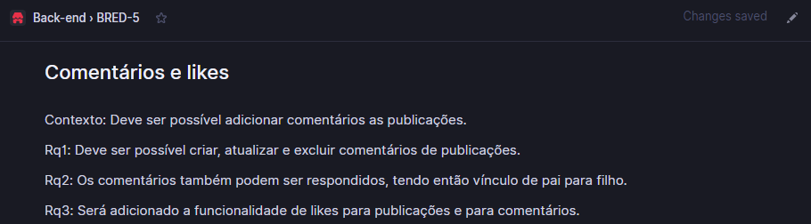
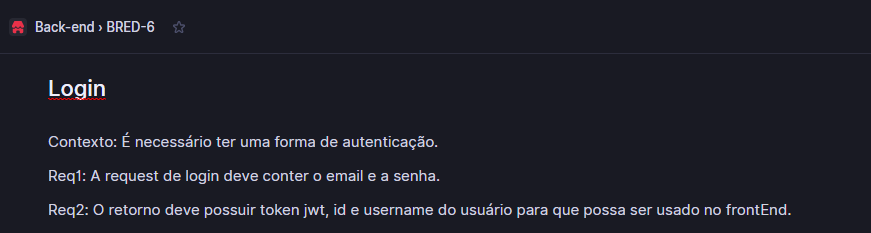
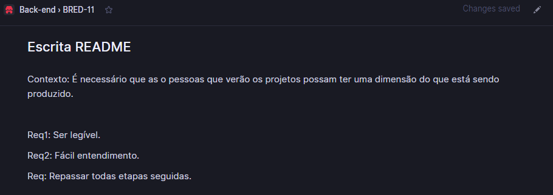
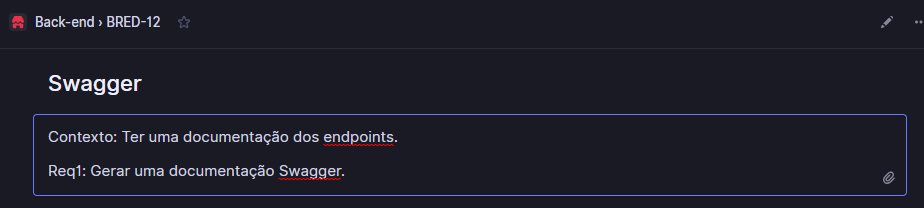
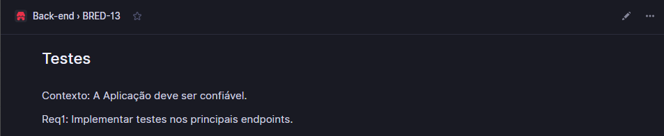

# Desenvolvimento do projeto

---

O desenvolvimento usou a metodologia FDD e ferramenta linear.
Os cards gerados foram com a sigla BRED:Back-end Rede social.

BRED-1

BRED-2

BRED-3

BRED-5

BRED-6

BRED-11

BRED-12

BRED-13

