# Rede social para a comunidade 

---

O projeto possui o Objetivo de conectar pessoas que querem ajudar e entidades que precisam dessa ajuda ou pessoas com iniciativa de tornar a vida de outros um pouco melhor, de forma tal que ações
podem ser publicadas tanto para divulgação de projetos que irão acontecer, como para mostrar ações que já foram desenvolvidas.

# Funcionalidades do projeto

---

### Possui as entidades de User, Follower, Comment e Post.

* O presente repositório tem o objetivo de possuir os endpoints que farão a manipulação do banco de dados e possuirá toda a regra de negócio do projeto.
* Permite criar, editar, remover, recuperar usuário ou lista de usuários.
* Permite criar, editar, remover, recuperar post ou lista de post. 
* Retorna post de outros usuários no qual o usuário atual segue.
* Permite seguir outros usuários, deixar de seguir e retorna a lista de usuários que seguem o usuário.
* Permite criar, editar, remover e recuperar comentários em posts, ou retornar comentário de resposta para outros comentários.
* Possui hierárquia de comentários.
* Dar likes em posts e comentários.
* A autenticação é feita por token JWT e a senha é criptografada.

# Diagrama de caso de uso

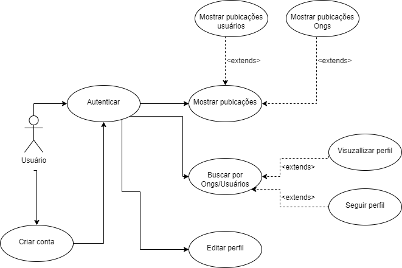

# Tecnologia utilizada

O projeto usa Quarkus, o Supersônico Subatômico Java Framework.

Se você deseja aprender mais sobre Quarkus -> https://quarkus.io/ .

# Banco de dados

----

### O banco de dados escolhido foi o MySql.

* Baixar localmente [MySql](https://dev.mysql.com/downloads/workbench/)

Configurar com Usuário, senha e porta ->

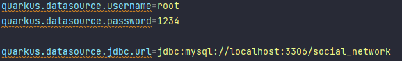

Para criar o banco utilize os comando encontrados em:
src -> main -> resources -> db -> migration 


---

* User 

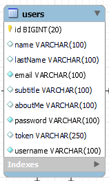

* Post

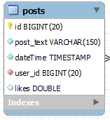

* Comment

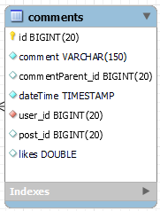

* Follower

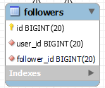

* Relacionamento Banco de dados

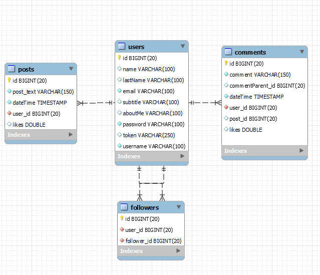


## Rodar aplicação em modo Dev

---

Você pode rodar a aplicação com o seguinte comando
```shell script
./mvnw compile quarkus:dev
```

---

## Swagger

---

Para visualizar o swagger:

* Acessar: http://localhost:8080/q/swagger-ui/#/

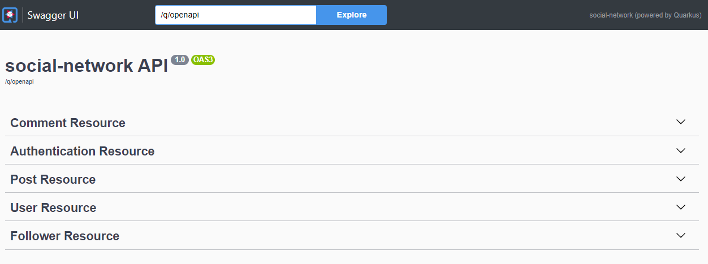

Authentication

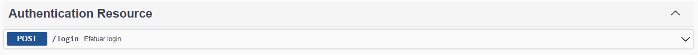

User

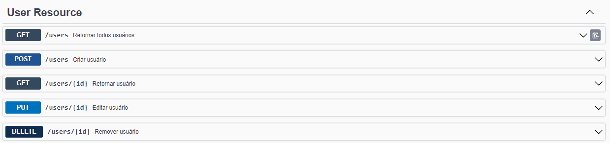

Comment

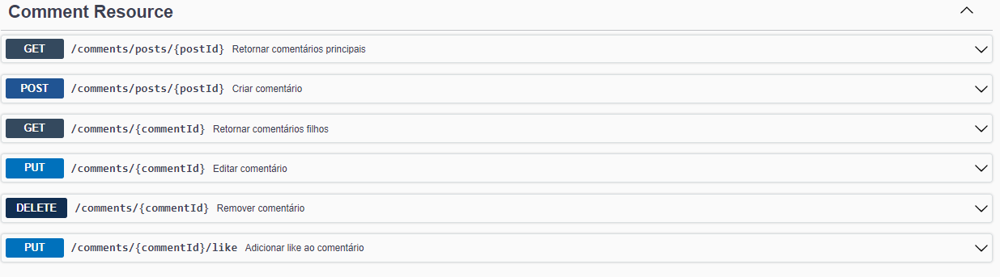

Post

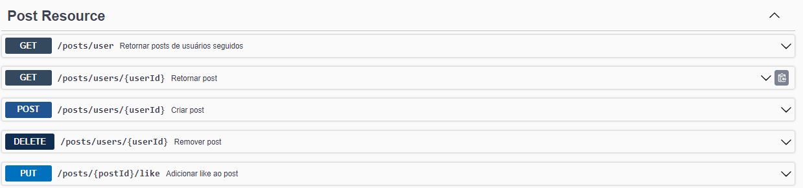

Follower

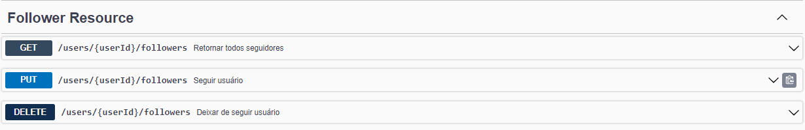

# Arquitetura do projeto

O Projeto foi criado utilizando java 11 com Quarkus. A arquitetura escolhida foi DDD.

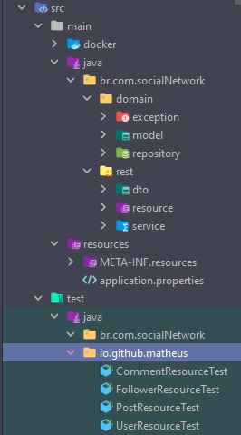

# Desenvolvimento do projeto

---

O desenvolvimento usou a metodologia FDD e ferramenta linear.
Os cards gerados foram com a sigla BRED:Back-end Rede social.

BRED-1


BRED-2


BRED-3


BRED-5


BRED-6


BRED-11


BRED-12


BRED-13


