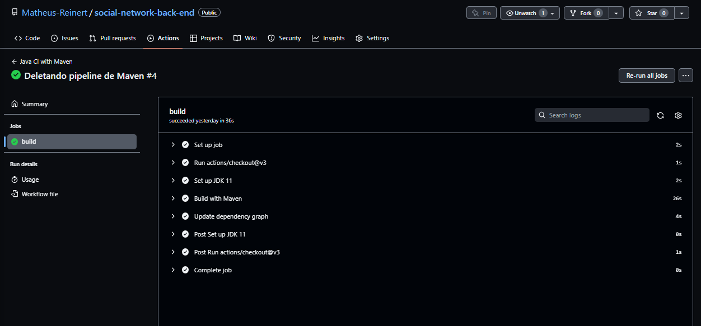
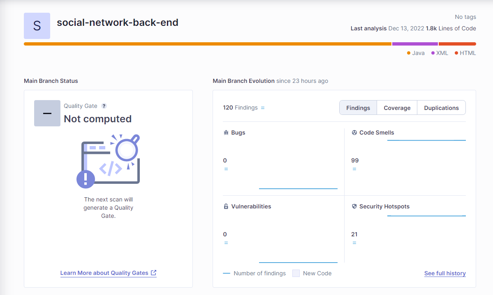

# Rede social para a comunidade

O projeto possui o Objetivo de conectar pessoas que querem ajudar e entidades que precisam dessa ajuda ou pessoas com iniciativa de tornar a vida de outros um pouco melhor, de forma tal que ações
podem ser publicadas tanto para divulgação de projetos que irão acontecer, como para mostrar ações que já foram desenvolvidas.

---

# Requisitos do protótipo

Para efetivação desta proposta, o repositório possui os endpoints que farão a manipulação do banco de dados com toda a regra de negócio do projeto, tendo as principais entidades do projeto como: User, Follower, Post e Comment.
O projeto usa Quarkus, o Supersônico Subatômico Java Framework. E, a fim de pontuar as principais pontos que o sistema deve atender, foram criados os requisitos de sistemas, que são descrições das funcionalidades, sejam elas funcionais ou não funcionais, que o sistema deve ter. Entende-se por descrições, as funções, qualidades, competências e características levantadas durante um estudo de requisitos.

---

# Requisitos Funcionais


* RF001: Permitir criar, editar, remover, recuperar usuário ou lista de usuários.
* RF002: Permitir criar, editar, remover, recuperar post ou lista de post. 
* RF003: Retornar post de outros usuários no qual o usuário atual segue.
* RF004: Permitir seguir outros usuários, deixar de seguir e retornar a lista de usuários que seguem o usuário.
* RF005: Permitir criar, editar, remover e recuperar comentários em posts, ou retornar comentário de resposta para outros comentários.
* RF006: Possuir hierárquia de comentários.
* RF007: Dar likes em posts e comentários.
* RF008: A autenticação é feita por token JWT.

# Requisitos não funcionais

* NRF001: O sistema deverá ter disponibilidade de 99%.
* NRF002: Deve possuir cobertura de teste.
* NRF003: A senha deve possui criptografia.

---

# Diagramas de atividade


---

# Tecnologia utilizada

O projeto usa Quarkus, o Supersônico Subatômico Java Framework.
Se você deseja aprender mais sobre Quarkus -> https://quarkus.io/ .

---

# Banco de dados
### O banco de dados escolhido foi o MySql.

* Baixar localmente [MySql](https://dev.mysql.com/downloads/workbench/)

Configurar com Usuário, senha e porta ->


Para criar o banco utilize os comando encontrados em:
src -> main -> resources -> db -> migration

# Relacionamentos Banco de dados

Na criação dessa estrutura, definiu-se algumas classes bem como as tabelas necessárias para armazenar os campos e seus valores. O modelo entidade-relacional descrevendo os relacionamentos entre as tabelas no banco de dados MySql


* User 


* Post


* Comment


* Follower


---

## Rodar aplicação em modo Dev


Você pode rodar a aplicação com o seguinte comando
```shell script
./mvnw compile quarkus:dev
```

---

## Swagger

Uma vez definida a estrutura do trabalho, modelo entidade-relacional com as tabelas e os campos do banco de dados, faz-se necessário documentar. Por meio do Swagger, responsável pelas visualizações dos endpoints, é possível ver melhor as funcionalidades do projeto.


Para visualizar o swagger:

* Acessar: http://localhost:8080/q/swagger-ui/#/


Authentication


User


Comment


Post


Follower


---

# Arquitetura do projeto

O Projeto foi criado utilizando java 11 com Quarkus.


---

# Integração contínua

Utilizando o GitHub para armazenamento do repositório, se faz necessário a integração das alterações para validação do código. 
Dessa forma o projeto possui integração de Java CI com Maven.



# Inspeção do código com SonarCloud

O SonarCloud é uma plataforma em nuvem para exibir o processo de inspeção continua do código de sua aplicação. Para isso, o SonarCloud utiliza o SonarQube para realizar a “varredura” em seu código fonte e analisar possíveis vulnerabilidade, erros e regras específicas da linguagem. 
O projeto de Redes Sociais foi inspecionado e mostrou os seguinntes detalhes.



---

# Desenvolvimento do projeto

[Cards](https://github.com/Matheus-Reinert/social-network-back-end/blob/master/CARDS.md)

