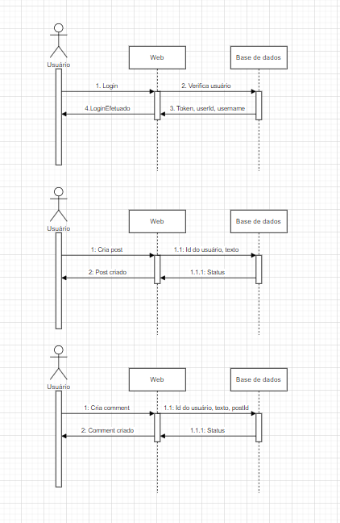

# Rede social para a comunidade 

---

O projeto possui o Objetivo de conectar pessoas que querem ajudar e entidades que precisam dessa ajuda ou pessoas com iniciativa de tornar a vida de outros um pouco melhor, de forma tal que ações
podem ser publicadas tanto para divulgação de projetos que irão acontecer, como para mostrar ações que já foram desenvolvidas.

# Requisitos Funcionais

---

### Possui as entidades de User, Follower, Comment e Post.

O presente repositório tem o objetivo de possuir os endpoints que farão a manipulação do banco de dados e possuirá toda a regra de negócio do projeto.

* Req1: Permitir criar, editar, remover, recuperar usuário ou lista de usuários.
* Req2: Permitir criar, editar, remover, recuperar post ou lista de post. 
* Req3: Retornar post de outros usuários no qual o usuário atual segue.
* Req4: Permitir seguir outros usuários, deixar de seguir e retornar a lista de usuários que seguem o usuário.
* Req5: Permitir criar, editar, remover e recuperar comentários em posts, ou retornar comentário de resposta para outros comentários.
* Req6: Possuir hierárquia de comentários.
* Req7: Dar likes em posts e comentários.
* Req8: A autenticação é feita por token JWT e a senha é criptografada.

# Requisitos não funcionais

* Req1: O sistema deverá ter disponibilidade de 99%
* Req2: Deve possuir cobertura de teste
* Req3: Uso de POO

# Diagramas de atividade



# Tecnologia utilizada

O projeto usa Quarkus, o Supersônico Subatômico Java Framework.

Se você deseja aprender mais sobre Quarkus -> https://quarkus.io/ .

# Banco de dados

----

### O banco de dados escolhido foi o MySql.

* Baixar localmente [MySql](https://dev.mysql.com/downloads/workbench/)

Configurar com Usuário, senha e porta ->


Para criar o banco utilize os comando encontrados em:
src -> main -> resources -> db -> migration 


---

* User 


* Post


* Comment


* Follower


* Relacionamento Banco de dados


## Rodar aplicação em modo Dev

---

Você pode rodar a aplicação com o seguinte comando
```shell script
./mvnw compile quarkus:dev
```

---

## Swagger

---

Para visualizar o swagger:

* Acessar: http://localhost:8080/q/swagger-ui/#/


Authentication


User


Comment


Post


Follower


# Arquitetura do projeto

O Projeto foi criado utilizando java 11 com Quarkus. A arquitetura escolhida foi DDD.


# Desenvolvimento do projeto

[Cards](https://github.com/Matheus-Reinert/social-network-front/blob/master/CARDS.md)

